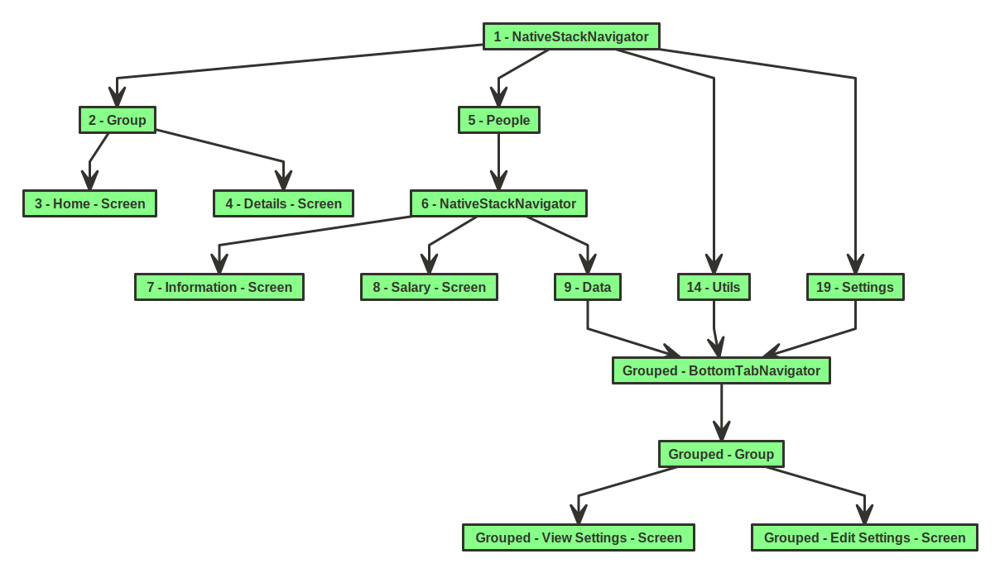
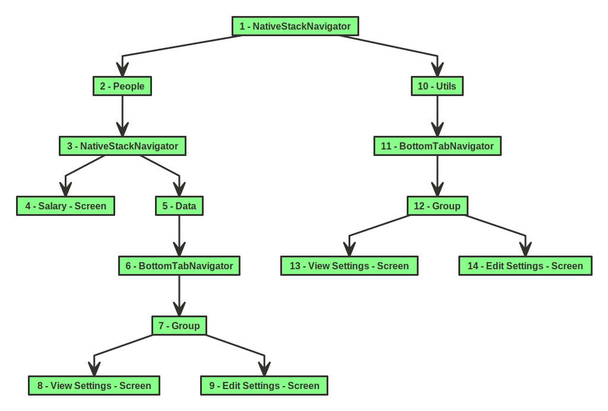
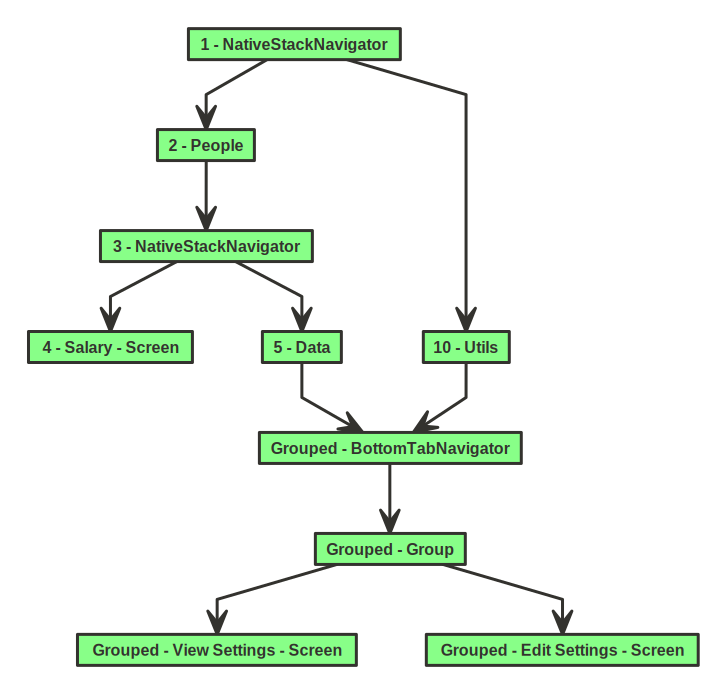

# react-navigation-schema
A schema generator extension for [react-navigation](https://github.com/react-navigation/react-navigation). Simply pass your [NavigationContainer](https://reactnavigation.org/docs/navigation-container/) and `react-navigation-schema` will provide you with an svg schema and the corresponding JSON file.



Click [here](https://github.com/dbilgin/react-navigation-schema/blob/master/assets/main/react-navigation-schema.json) to see the JSON for this schema.


## Installation

```bash
yarn add -D react-navigation-schema
```

## Usage

### Start the server

First we need to start our server that generates the files for us. In your terminal, go to the root of the project and run:

```bash
yarn react-navigation-schema
```

This should start our server and give you this initial result:

```bash
react-navigation-schema server running at http://127.0.0.1:3000/
```

You need to have this terminal running if you want your schema to be generated.

### Add the generator

Now pass your `NavigationContainer` as a `JSX.Element`, so the generator can do its magic.

```js
import { createNavigationSchema } from 'react-navigation-schema';

...
  useEffect(() => {
    createNavigationSchema(Container());
  }, []);

...

export function Container() {
  return (
    <NavigationContainer>
      <Stack.Navigator>
        <Stack.Group>
          <Stack.Screen name="Home" component={SomeScreen} />
          <Stack.Screen name="Details" component={SomeScreen} />
        </Stack.Group>
        <Stack.Screen name="People" component={PeopleStack} />
        <Stack.Screen name="Utils" component={SettingsStack} />
        <Stack.Screen name="Settings" component={SettingsStack} />
      </Stack.Navigator>
    </NavigationContainer>
  );
}
```

You can call the `createNavigationSchema` anywhere you like as long as you can pass the `NavigationContainer` inside it properly. Since this is a dev environment thing, it will only work in the condition of `__DEV__ === true`;
Now all you have to do is run the application as regular on an emulator.

```bash
yarn android
```

### Example

<details>
  <summary>The example for the above displayed schema</summary>

```js
import React, { useEffect } from 'react';
import type { Node } from 'react';
import { NavigationContainer } from '@react-navigation/native';
import { createNativeStackNavigator } from '@react-navigation/native-stack';
import SomeScreen from './screens/SomeScreen';
import PeopleStack from './screens/PeopleStack';
import SettingsStack from './screens/SettingsStack';
import { createNavigationSchema } from 'react-navigation-schema';

const MainStack = createNativeStackNavigator();
const People = createNativeStackNavigator();
const Tab = createBottomTabNavigator();

const App: () => Node = () => {
  useEffect(() => {
    createNavigationSchema(Container());
  }, []);

  return <Container />;
};

export default App;

export function Container() {
  return (
    <NavigationContainer>
      <MainStack.Navigator>
        <MainStack.Group>
          <MainStack.Screen name='Home' component={SomeScreen} />
          <MainStack.Screen name='Details' component={SomeScreen} />
        </MainStack.Group>
        <MainStack.Screen name='People' component={PeopleStack} />
        <MainStack.Screen name='Utils' component={SettingsStack} />
        <MainStack.Screen name='Settings' component={SettingsStack} />
      </MainStack.Navigator>
    </NavigationContainer>
  );
}

function PeopleStack() {
  return (
    <People.Navigator>
      <People.Screen name='Information' component={SomeScreen} />
      <People.Screen name='Salary' component={SomeScreen} />
      <People.Screen name='Data' component={SettingsStack} />
    </People.Navigator>
  );
}

function SettingsStack() {
  return (
    <Tab.Navigator id='Grouped'>
      <Tab.Group navigationKey='Grouped'>
        <Tab.Screen navigationKey='Grouped' name='View Settings' component={SomeScreen} />
        <Tab.Screen navigationKey='Grouped' name='Edit Settings' component={SomeScreen} />
      </Tab.Group>
    </Tab.Navigator>
  );
}

```
</details>

### Parameters

You can currently change the port, background color, font size and spacing via the server. Here's a simple example:

```bash
yarn react-navigation-schema --port=12345 --color=red --spacing=30 --fontSize=12
```

One thing to remember here is if you want to set the port, you also have to pass the same port as a parameter inside `createNavigationSchema`.

```js
createNavigationSchema(Container(), 12345);
```

## Grouping & Ungrouping

### Ungrouping

Sometimes it is necessary to use the same stack twice under one navigation tree. You can decide how you want this to be displayed in the schema. The default behavior for this is `ungrouped`.

<details>
  <summary>This is a simple example to show the SettingsStack being used twice.</summary>

```js
export function Container() {
  return (
    <NavigationContainer>
      <Stack.Navigator>
        <Stack.Screen name="People" component={PeopleStack} />
        <Stack.Screen name="Utils" component={SettingsStack} />
      </Stack.Navigator>
    </NavigationContainer>
  );
}

function PeopleStack() {
  return (
    <People.Navigator>
      <People.Screen name="Salary" component={SomeScreen} />
      <People.Screen name="Data" component={SettingsStack} />
    </People.Navigator>
  );
}

function SettingsStack() {
  return (
    <Tab.Navigator>
      <Tab.Group>
        <Tab.Screen name="View Settings" component={SomeScreen} />
        <Tab.Screen name="Edit Settings" component={SomeScreen} />
      </Tab.Group>
    </Tab.Navigator>
  );
}
```
</details>

This example will result in this:



JSON file [here](https://github.com/dbilgin/react-navigation-schema/blob/master/assets/ungrouped/react-navigation-schema.json) for reference.

As you can see, even though `5 - Data` and `10 - Utils` are the exact same, they get split into separate branches. This happens because of the auto-generated identifiers that you see in the beginning of every node. This is necessary because otherwise there can be unwanted match-ups due to names and the schema would be completely broken.

### Grouping

So how does grouping work? It's actually very simple, you just need to identify the grouped stacks and screens.

<details>
  <summary>Our ungrouped example would look like this when grouped.</summary>

```js
export function NavCon() {
  return (
    <NavigationContainer>
      <Stack.Navigator>
        <Stack.Screen name="People" component={PeopleStack} />
        <Stack.Screen name="Utils" component={SettingsStack} />
      </Stack.Navigator>
    </NavigationContainer>
  );
}

function PeopleStack() {
  return (
    <People.Navigator>
      <People.Screen name="Salary" component={SomeScreen} />
      <People.Screen name="Data" component={SettingsStack} />
    </People.Navigator>
  );
}

function SettingsStack() {
  return (
    <Tab.Navigator id="Grouped">
      <Tab.Group navigationKey="Grouped">
        <Tab.Screen
          navigationKey="Grouped"
          name="View Settings"
          component={SomeScreen}
        />
        <Tab.Screen
          navigationKey="Grouped"
          name="Edit Settings"
          component={SomeScreen}
        />
      </Tab.Group>
    </Tab.Navigator>
  );
}
```
</details>

Here's the schema result:



JSON file [here](https://github.com/dbilgin/react-navigation-schema/blob/master/assets/grouped/react-navigation-schema.json) for reference.

As you can see, now both `5 - Data` and `10 - Utils` go to the same `BottomTabNavigator`. This grouping can be achieved with either the `id` or the `navigationKey` props.
